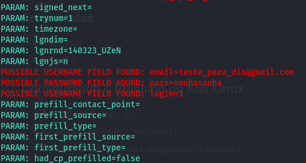

# Phishing para captura de senhas do Facebook

### Ferramentas

- Kali Linux
- setoolkit

### Configurando o Phishing no Kali Linux

- Acesso root: ``` sudo su ```
- Iniciando o setoolkit: ``` setoolkit ```
- Tipo de ataque: ``` Social-Engineering Attacks ```
- Vetor de ataque: ``` Web Site Attack Vectors ```
- Método de ataque: ```Credential Harvester Attack Method ```
- Método de ataque: ``` Site Cloner ```
- Obtendo o endereço da máquina: ``` ifconfig ```
- URL para clone: http://www.facebook.com

### Resutados do Cassiano-Dio


### Meus Resultados



Obs: Atualizações por parte dos navegadores atuais ou do próprio Facebook, tornaram difícil essa prática. Para conseguir acesso ao usuário e senha, foi necessário rodar o clone em um navegador desatualizado, da seguinte forma:

- VM Windows 7 + Internet Explorer
